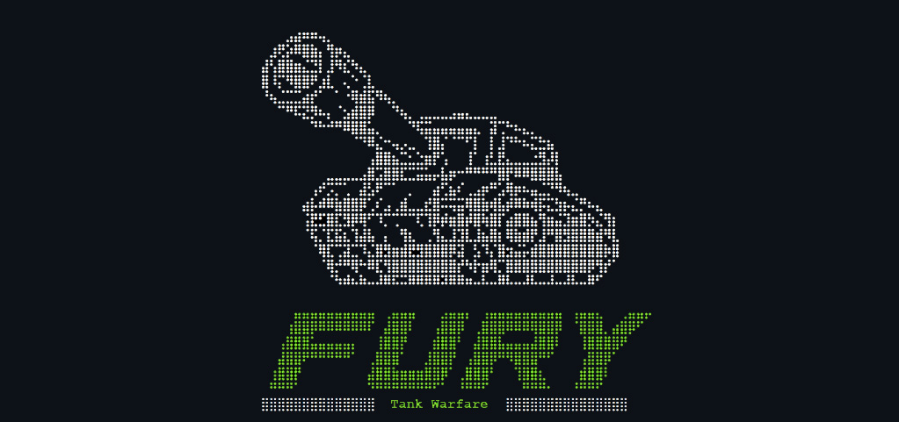

# FURY
## **Game Overview**

"FURY" tank battle game is a single player board game where the player's goal is to destroy all enemy tanks on the board within a limited number of turns. The player must choose a difficulty level (easy, medium, or hard) before starting the game. The game is played by guessing a row (letter) and column (number) on the enemy board to target a tank.

---
​

#### [The deployed website is here on Heroku](https://fury-p3.herokuapp.com)​

## Table of contents:
1. [**Game Overview**](#game-overview)
1. [**Planning stage**](#planning-stage)
    * [***Planning Overview***](#planning-overview)
    * [***User Stories***](#user-stories)
    * [***Game Aims***](#game-aims)
    * [***Wireframes***](#wireframes)
    * [***Logic Flow***](#wireframes)
    * [***Color Scheme***](#color-scheme)
    * [***Design Choices***](#design-choices)
1. [**Game Features**](#game-features)
    * [***FEATURE1***](#feature1)
    * [***FEATURE2***](#feature2)
    * [***FEATURE3***](#feature3)
    * [***FEATURE4***](#feature4)
    * [***FEATURE5***](#feature5)
    * [***FEATURE6***](#feature6)
    * [***FEATURE7***](#feature7)
    * [***FEATURE8***](#feature8)
    * [***FEATURE9***](#feature9)
1. [**Testing**](#testing)
1. [**Deployment**](#deployment)
1. [**Technology and Applications**](#technology-and-applications)
1. [**Future-Enhancements**](#future-enhancements)
    * [***User Enhancements***](#user_enhacements)
    * [***Internal Enhancements***](#internal_enhacements)
1. [**Credits**](#credits)
    * [**Honorable mentions**](#honorable-mentions)
    * [**Content**](#content)
    * [**Media**](#media)

---

## **Planning Stage**

### **Planning Overview:**

PLANNING OVERVIEW TEXT

  Core aims for the project:

* AIM 1
* AIM 2
* AIM 3
* AIM 4
* AIM 5
* AIM 6
* AIM 7
* AIM 8

### **Target Audiences:**

* People that like
* People that like
* People that like
* People that like
* People that like

### **User Stories:**

* As a player, I want
* As a player, I want
* As a player, I want
* As a player, I want
* As a player, I want

### **Game Aims:**

* The game should
* The game should
* The game should
* The game should
* The game should
* The game should
* The game should

---

### **Wireframes:**

TEXT

---

### **Logic Flow:**

TEXT

---
​
### **Color Scheme:**

TEXT

- Text
- Text

- Text

- Text

- Text

- Text

### **Design Choices**
​
TEXT

---
​
## **Game Features**

### ***FEATURE 1***

TEXT

- text
- text
- text
- text
- text
- text
- text

TEXT
- TEXT

TEXT

#### *Example*

---

### **FEATURE 1**

---

### **FEATURE 2**

---
### **FEATURE 3**

---
### **FEATURE 4**

---
### **FEATURE 5**

---
### **FEATURE 6**

---
### **FEATURE 7**

---
### **FEATURE 8**

---
### **FEATURE 9**

### **Performance Summary**

SUMMARY TEXT

- text
- text
- text
- text
- text
- text
- text
- text

---
## **Testing**

Testing documentation is [here](./TESTING.md)

## **Deployment**

- 
- 
- 
- 
-  

### **GitHub** 
  

---
​
## **Technology and Applications**
​
These are the technologies used for this project.

- Python 3.8.11
- Gitpod
- Github
- Heroku

----

## **Future-Enhancements**

### **User Enhancements**

* 
* 
* 

### **Internal Enhancements**

* 
* 
* 

## **Credits**
### **Honorable mentions**
​

​
### **Content:**
​
  
### **Media:**
​
* 