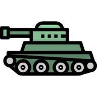

# FURY

## **Game Overview**

"FURY" tank battle game is a single player board game where the player's goal is to destroy all enemy tanks on the board within a limited number of turns. The player must choose a difficulty level (easy, medium, or hard) before starting the game. The game is played by guessing a row (letter) and column (number) on the enemy board to target a tank.

---
​

#### [The deployed website is here on Heroku](https://fury-p3.herokuapp.com)​

## Table of contents:
1. [**Game Overview**](#game-overview)
1. [**Planning stage**](#planning-stage)
    * [***Planning Overview***](#planning-overview)
    * [***User Stories***](#user-stories)
    * [***Game Aims***](#game-aims)
    * [***Wireframes***](#wireframes)
    * [***Logic Flow***](#wireframes)
    * [***Color Scheme***](#color-scheme)
    * [***Design Choices***](#design-choices)
1. [**Game Features**](#game-features)
    * [***FEATURE1***](#feature1)
    * [***FEATURE2***](#feature2)
    * [***FEATURE3***](#feature3)
    * [***FEATURE4***](#feature4)
    * [***FEATURE5***](#feature5)
    * [***FEATURE6***](#feature6)
    * [***FEATURE7***](#feature7)
    * [***FEATURE8***](#feature8)
    * [***FEATURE9***](#feature9)
1. [**Testing**](#testing)
1. [**Deployment**](#deployment)
1. [**Technology and Applications**](#technology-and-applications)
1. [**Future-Enhancements**](#future-enhancements)
    * [***User Enhancements***](#user_enhacements)
    * [***Internal Enhancements***](#internal_enhacements)
1. [**Credits**](#credits)
    * [**Honorable mentions**](#honorable-mentions)
    * [**Content**](#content)
    * [**Media**](#media)

---

## **Planning Stage**

### **Planning Overview:**

The initial concept of the game was a Battleship-style game, where the player guesses the location of the enemy's ships. However, during the development, the concept was switched to a tank board game where the player tries to destroy the enemy tanks on a grid.

"FURY" was chosen from one of your favorite movies, which represents the theme of the game well.

  Core aims for the project:

* Maximize visual elements while utilizing a text-based terminal
* Deliver a seamless user experience
* Implement login and registration features
* Integrate a leaderboard feature for top players
* Establish a scoring system that takes difficulty levels into account
* Update scores according to player registration status
* Position tanks randomly on each game board
* Offer an enjoyable challenge with rewards

### **Target Audiences:**

* Python programmers interested in game logic
* Fans of the movie Fury and military-themed entertainment
* Casual players seeking strategic games for enjoyable pastime
* Competitive individuals striving to surpass high scores
* Individuals interested in honing their tactical skills in a single-player setting

### **User Stories:**

* As a player, I want a game featuring well-defined goals
* As a player, I want inputs that are easy to use and provide quick responses
* As a player, I want entertaining and engaging gameplay experience
* As a player, I want clear instructions on how to play the game
* As a player, I want to view my score and see the results of my gameplay

### **Game Aims:**

* The game should feature clear rules to help players navigate through the gameplay
* The game should offer a main menu and user menu for easy navigation and user control
* The game should be straightforward and easy to grasp for new players
* The game should feature a specified turn limit to add structure and strategy to the gameplay
* The game should automatically update the scores of registered players
* The game should give players informative and precise feedback to enhance the gaming experience.

---

### **Wireframes:**

The wireframes for the website were produced in [Balsamiq](https://balsamiq.com). The frames shown below are menus and game play on left and right side. The final site might be slightly different from the wireframes due to developments that occured during the creation process. 

---

### **Logic Flow:**

I created a high-level logic flowchart in [Draw.io](https://draw.io)

---
​
### **Color Scheme:**

The limited color availability in the Python terminal I was working with had an impact on my decision-making process. However, I was fortunate enough to be able to choose the main colors required for the game despite this limitation.
I used colorama library with color constants to achieve the desired color scheme.

-  $\colorbox{green}{{\color{black}{GREEN}}}$ : Was utilized for the Fury Logo as well as some event messages in the game.

- $\colorbox{yellow}{{\color{black}{YELLOW}}}$ : was primarily used for displaying informational pieces such as rules and certain event messages in the game.

- $\colorbox{red}{{\color{black}{RED}}}$ : was utilized for displaying error messages or certain important information in the game.

- $\colorbox{magenta}{{\color{black}{MAGENTA}}}$ : was used to differentiate menu headings from other elements, providing a unique and distinct style.

- $\colorbox{cyan}{{\color{black}{CYAN}}}$ : was assigned to list numbers for choices and the terminal prompt cursor.

- $\colorbox{black}{{\color{white}{BRIGHT/BOLD}}}$ : Was applied to make the colors in the game more vibrant and visible.

- $\colorbox{gray}{{\color{white}{DIM}}}$ : was utilized for the inner section of the board in order to provide a contrast and ensure that events within this section were easily visible.

### **Design Choices**
​
When designing "FURY", I prioritized a clean and minimalistic user interface that would allow players to focus on the gameplay without distraction.

---
​
## **Game Features**

### ***INTRO LOGO***

TEXT

- text
- text
- text
- text
- text
- text
- text

TEXT
- TEXT

TEXT

#### *Example*

---

### **FEATURE 1**

---

### **FEATURE 2**

---
### **FEATURE 3**

---
### **FEATURE 4**

---
### **FEATURE 5**

---
### **FEATURE 6**

---
### **FEATURE 7**

---
### **FEATURE 8**

---
### **FEATURE 9**

### **Performance Summary**

SUMMARY TEXT

- text
- text
- text
- text
- text
- text
- text
- text

---
## **Testing**

Testing documentation is [here](./TESTING.md)

## **Deployment**

- 
- 
- 
- 
-  

### **GitHub** 
  

---
​
## **Technology and Applications**
​
These are the technologies used for this project.

- Python 3.8.11
- Gitpod
- Github
- Heroku

----

## **Future-Enhancements**

### **User Enhancements**

* 
* 
* 

### **Internal Enhancements**

* 
* 
* 

## **Credits**
### **Honorable mentions**
​

​
### **Content:**
​
  
### **Media:**
​
* 