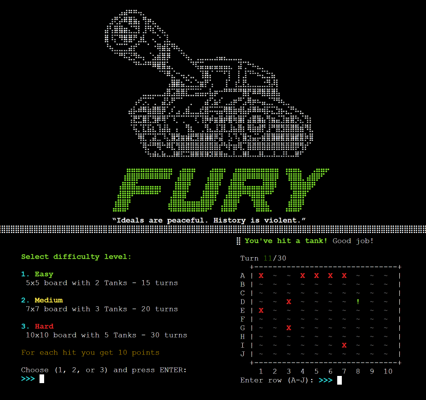
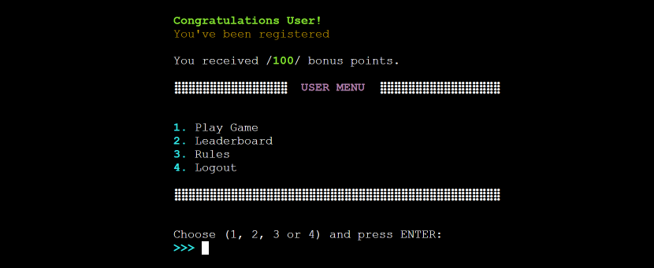
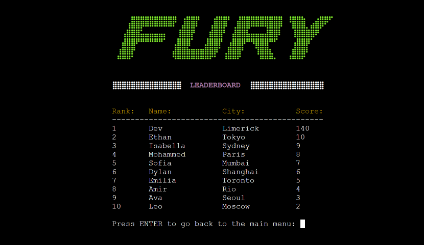
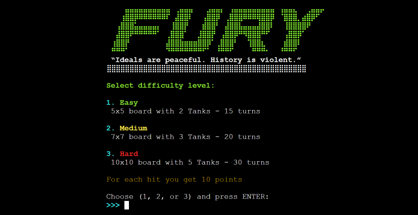

# "FURY" 🪖 Tank Battle Game
## **Game Overview**

"FURY" tank battle game is a single player board game where the player's goal is to destroy all enemy tanks on the board within a limited number of turns. The player must choose a difficulty level (easy, medium, or hard) before starting the game. The game is played by guessing a row (letter) and column (number) on the enemy board to target a tank.

---
​

#### [The deployed website is here on Heroku](https://fury-p3.herokuapp.com)​

## Table of contents:
1. [**Game Overview**](#game-overview)
1. [**Planning stage**](#planning-stage)
    * [***Planning Overview***](#planning-overview)
    * [***User Stories***](#user-stories)
    * [***Game Aims***](#game-aims)
    * [***Wireframes***](#wireframes)
    * [***Logic Flow***](#wireframes)
    * [***Color Scheme***](#color-scheme)
    * [***Design Choices***](#design-choices)
1. [**Main Features**](#main-features)
    * [***Intro Logo***](#intro-logo)
    * [***Loading Screen***](#loading-screen)
    * [***Main Menu***](#main-menu)
    * [***User Menu***](#user-menu)
1. [**Game Features**](#game-features)
    * [***Difficulty Select***](#difficulty-select)
    * [***Game Board***](#game-board)
    * [***Game Events***](#game-events)
    * [***Input Validation***](#input-validation)
    * [***Game End***](#game-end)
1. [**Testing**](#testing)
1. [**Deployment**](#deployment)
1. [**Technology and Applications**](#technology-and-applications)
1. [**Future-Enhancements**](#future-enhancements)
1. [**Credits**](#credits)
    * [**Honorable mentions**](#mentions)
    * [**Content**](#content)
    * [**Media**](#media)

---

## **Planning Stage**

### **Planning Overview:**

The initial concept of the game was a Battleship-style game, where the player guesses the location of the enemy's ships. However, during the development, the concept was switched to a tank board game where the player tries to destroy the enemy tanks on a grid instead.

"FURY" was chosen from one of my favorite movies, which represents the theme of the game well.

  Core aims for the project:

* Maximize visual elements while utilizing a text-based terminal
* Deliver a seamless user experience
* Implement login and registration features
* Integrate a leaderboard feature for top players
* Establish a scoring system that takes difficulty levels into account
* Update scores according to player registration status
* Position tanks randomly on each game board
* Offer an enjoyable challenge with rewards

### **Target Audiences:**

* Python programmers interested in game logic
* Fans of the movie Fury and military-themed entertainment
* Casual players seeking strategic games for enjoyable pastime
* Competitive individuals striving to surpass high scores
* Individuals interested in honing their tactical skills in a single-player setting

### **User Stories:**

* As a player, I want a game featuring well-defined goals
* As a player, I want inputs that are easy to use and provide quick responses
* As a player, I want entertaining and engaging gameplay experience
* As a player, I want clear instructions on how to play the game
* As a player, I want to view my score and see the results of my gameplay

### **Game Aims:**

* The game should feature clear rules to help players navigate through the gameplay
* The game should offer a main menu and user menu for easy navigation and user control
* The game should be straightforward and easy to grasp for new players
* The game should feature a specified turn limit to add structure and strategy to the gameplay
* The game should automatically update the scores of registered players
* The game should give players informative and precise feedback to enhance the gaming experience.

---

[Back to top](<#table-of-contents>)

---

### **Wireframes:**

The wireframes for the website were produced in [Balsamiq](https://balsamiq.com). The frames shown below are menus and game play on left and right side. The final site might be slightly different from the wireframes due to developments that occured during the creation process. 

---

### **Logic Flow:**

I created a high-level logic flowchart in [Draw.io](https://draw.io)

---
​
### **Color Scheme:**

The limited color availability in the Python terminal I was working with had an impact on my decision-making process. However, I was fortunate enough to be able to choose the main colors required for the game despite this limitation.
I used colorama library with color constants to achieve the desired color scheme.

-  $\colorbox{green}{{\color{black}{GREEN}}}$ : Was utilized for the Fury Logo as well as some event messages in the game.

- $\colorbox{yellow}{{\color{black}{YELLOW}}}$ : was primarily used for displaying informational pieces such as rules and certain event messages in the game.

- $\colorbox{red}{{\color{black}{RED}}}$ : was utilized for displaying error messages or certain important information in the game.

- $\colorbox{magenta}{{\color{black}{MAGENTA}}}$ : was used to differentiate menu headings from other elements, providing a unique and distinct style.

- $\colorbox{cyan}{{\color{black}{CYAN}}}$ : was assigned to list numbers for choices and the terminal prompt cursor.

- $\colorbox{black}{{\color{white}{BRIGHT/BOLD}}}$ : Was applied to make the colors in the game more vibrant and visible.

- $\colorbox{gray}{{\color{white}{DIM}}}$ : was utilized for the inner section of the board in order to provide a contrast and ensure that events within this section were easily visible.

### **Design Choices**
​
When designing "FURY", I prioritized a clean and minimalistic user interface that would allow players to focus on the gameplay without distraction.

---

[Back to top](<#table-of-contents>)

---
​
# **Main Features :**

### ***INTRO LOGO***

I utilized ASCII art to create the FURY text for the logo and incorporated a pre-existing tank ASCII design to emphasize the theme of a tank warfare game.

- Incorporated introductory text to provide a glimpse into the game's theme and content.

- Included a "Ready to play" prompt, allowing users to decide whether they want to proceed with playing the game.

- Should the user opt not to continue, they will be presented with a "shutting down" message, along with instructions on how to restart the game.

Intro Logo Example

---

### ***LOADING SCREEN***

Upon the user's decision to continue, the loading screen features a simplified version of the logo, enhancing the overall user experience.

- Sequential loading event messages are presented with a typewriter-style animation for added visual appeal.

- While the "game loaded" message is being prepared for display, the fury_data API is loaded silently in the background.

- Once the game has successfully loaded, the "Game loaded successfully" text appears and the screen is cleared to present the main menu.

Loading Screen Example

---

[Back to top](<#table-of-contents>)

---

## ***MAIN MENU***

The main menu is presented without a logo to enhance user experience, particularly when an error message for an invalid option is displayed. Headings are distinguished with a magenta color to stand out and create visual separation.

Main Menu Example

---

## Option 1. Play Game
- Allows users to play without the requirement of logging in or registering an account.
- Before presenting the difficulty selection screen, a prompt is displayed asking users if they would like to view the game rules.

### ***Example:***

See Rules Example

## Option 2. Login
- The user is directed to a login screen where they can input their credentials to resume their progress within the game.

- The fury_data API checks for existing data in the Google Sheets high score sheet. 

- If the user is matched, they will be directed to the user-menu; otherwise, they will be returned to the main-menu with an error message displayed.

 ### ***Examples:***

Login Example

Login Success Example

Login Error Example

## Option 3. Register
- The user is directed to the registration screen, where they can sign up for an account, enabling their scores to be updated as they progress through the game.

- The fury_data API verifies whether a user with the same credentials already exists in the system.

- Users that encounter an issue during the registration process are redirected back to main-menu with error message displayed.

- Upon successful registration, the user is automatically logged in, greeted with a welcome message, and presented with the user menu.

 ### ***Examples:***

Register Screen Example

Register Error Example

Register Successful Example

## Option 4. Leaderboard
- The inclusion of a leaderboard on the main screen is designed to attract new players who take pleasure in examining scores and player standings, consequently encouraging them to register by providing a sense of motivation.

### ***Example:***

Leaderboard Example

---

[Back to top](<#table-of-contents>)

---
## ***USER MENU***

The user menu is also displayed without incorporating the logo to improve user experience, especially when an error message appears due to an invalid option. To make them more prominent and visually distinct, headings are highlighted with a magenta hue.

### ***Example:***

User Menu Example

---

## Option 1. Play Game
- Assuming that registered users are already familiar with the game, they are directly guided to the difficulty selection screen. However, if they need a refresher on the rules, option 3 is available at any time to review them.

### ***Example:***

Select Difficulty Example

## Option 2. Leaderboard
- The leaderboard is available as an option for registered users to track their progress and assess how close they are to achieving their desired ranking in the game.

### ***Example:***

Leaderboard Example

## Option 3. Rules
- This option allows users to view the game rules, which are presented in a clear and easy-to-understand format. Additionally, an ASCII art design border is incorporated for better user experience.

### ***Example:***

Rules Example

## Option 4. Logout
- The logout feature performs as expected, logging out the user to the main menu with a confirmation message. This feature can be useful for users who wish to register a new account or play without having their scores updated.

### ***Example:***

Logout Example

---

[Back to top](<#table-of-contents>)

---

# **Game Features :**

### ***Difficulty Selection***
- Whenever a new game is initiated, the player is prompted to select the difficulty level and the board size 
they would like to play.

- Each level offers a reward score multiplier bonus to provide an incentive for players to challenge themselves with harder difficulty.

### ***Example:***

Select Difficulty Example

---

### ***Game Boards***
- To make it easier for players to navigate the game and reduce the likelihood of input errors, the col and row values are automatically updated based on the selected board size.

- To enhance the user experience and make the gameplay more engaging, events on the game board are color-coded accordingly.

### ***Example:***

Game Boards Example

---
### ***Game Events***
- To keep the player informed about their progress and enable them to strategize for the game, the "turns left" event is continually updated throughout gameplay. The event updates automatically, using a color-coding system that changes from green to yellow to red to indicate how many turns the player has left. This feature provides players with a visual indicator of their remaining turns, allowing them to plan their moves accordingly and maximize their score.

- Players are introduced to game event messages that appear when they hit, miss, or go out of the grid during gameplay. By keeping players informed and engaged throughout the game, these event messages enhance the overall gaming experience and provide an added sense of challenge and excitement.

- Another event message that appears during gameplay is for hitting the same spot repeatedly. When this occurs, the player is penalized by losing a turn, which can affect their progress and score. This feature encourages players to plan their moves carefully and avoid hitting the same spot repeatedly, adding an extra layer of challenge and strategy to the game.

### ***Examples:***

Turns Example

Hit Example

Miss Example

Off Grid Example

Same Spot Example

---
### ***Input Validation***
- Choosing the correct row and column is essential to the gameplay experience, which is why input validation is implemented throughout the game. This feature ensures that the player enters a valid row and column value before proceeding with their move. If an invalid value is entered, an error message is displayed, and the player is prompted to re-enter the correct row and column value.

### ***Example:***

Input Validation Example

---
### ***Game End***
- Displaying the enemy board at the conclusion of each game, revealing the locations of the tanks the player missed, reinforces the game's fairness and randomness. By providing the player with a visual representation of the enemy board, players can see that the game is not rigged or biased in any way.

- Event messages are displayed to provide the player with feedback on their performance. Depending on whether the player has won or lost the game, the event messages can vary from congratulatory messages to messages indicating that the player has run out of turns.

- If the player is logged in, the fury_data API is called at the conclusion of the game to update the player's score. This feature enables the player's progress to be tracked and their ranking on the leaderboard to be adjusted accordingly.

- If the player is not signed in, they will be presented with a message indicating that their score has not been updated and that they need to register to have their progress tracked. This feature encourages players to register for an account, enabling them to track their progress and compete with other players on the leaderboard.

- To minimize menu navigation and improve the overall user experience, a "play again" option is displayed at the bottom of the game-over screen. This option enables the player to quickly start a new game without having to navigate back to the main menu.

### ***Examples:***

Not Logged In Example

Logged In Example

---

[Back to top](<#table-of-contents>)

---
## **Testing**

Testing documentation is [here](./TESTING.md)

## **Deployment**

I deployed the program on heroku and used manual deployment so I could verify all features as I committed code manually.

- Sign in to Heroku
- In Heroku 'Create new app' from the 'New' menu at the top right
- Follow the instructions
- In 'Config Vars' section select 'Reveal Config Vars'
- Enter PORT for the key and 8000 for the value
- Enter CREDS for they key
- For CREDS value use your creds.json information
- Scroll down to the 'Buildpacks' section
- Select 'Add' and add the `Python' buildpack
- Select 'Add' again and add the 'NodeJS' buildpack (this must be after adding the Python buildpack)
- Select 'Deploy' from the menu at the top
- Select 'GitHub' and confirm you wish to deploy using GitHub. You may be asked to enter your GitHub password
- Find the 'Connect to GitHub' section and use the search box to find the repo you want to deploy
- Connect to it and deploy Your site will shortly be deployed and you will be given a link to the deployed site when the process is complete.

### **GitHub** 
### Forking the GitHub Repository

You can fork the repository by following these steps:
1. Go to the GitHub repository
1. Click on Fork button in upper right hand corner

### Cloning the GitHub Repository

You can clone the repository to use locally by following these steps:
1. Navigate to the GitHub Repository you want to clone
2. Click on the code drop down button
3. Click on HTTPS
4. Copy the repository link to the clipboard
5. Open your IDE of choice (git must be installed for the next steps)
6. Type git clone copied-git-url into the IDE terminal

The project will now be cloned locally for you to use.

---
​
## **Technology and Applications**
​
These are the technologies used for this project.

- [Python 3.8.11](https://www.python.org/)
- [Gitpod](https://gitpod.io)
- [Github](https://github.com)
- [Heroku](https://heroku.com/)
- [Draw.io](www.draw.io)
- [Photoshop](https://www.adobe.com/ie/products/photoshop.html)

----

## **Future-Enhancements**

* Design a better TUI - Text based interface
* Nuke  event that would be randomly placed during gameplay.
* Add multiplayer to create a lobby system with matchmaking
* Improve code readability through refactoring

## **Credits**
### **Mentions**
I want to give a big shoutout to my family for their incredible support during the development of FURY.
​
### **Content:**

The name of the game, FURY, was inspired by the popular movie of the same name. The movie, which was released in 2014, was a war drama that received critical acclaim for its intense and gritty portrayal of tank warfare during World War II. The game FURY takes inspiration from this movie, recreating the excitement and strategy of tank battles in a virtual setting.
  
### **Media:**

The FURY heading was created using the ASCII Art Generator available on the website https://www.twitchquotes.com/ascii-art-generator. The process involved cropping a font text "FURY" and uploading it to the website to be generated into ASCII art.

The tank was taken from here: https://emojicombos.com/tank-text-art

---

[Back to top](<#table-of-contents>)

---

© Project developed by Karolis P. for Code Institute 2023