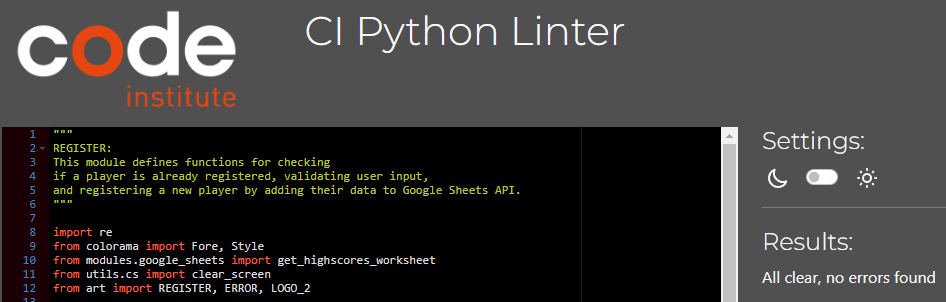

# FURY Testing
## Table of contents:
1. [**Testing Overview**](#testing-overview)
1. [**Linter Results**](#linter-results)
1. [**Manual Tests**](#manual-tests)
    * [***Test & Result***](#test-&-results)
    * [***Testing Feedback***](#testing-feedback)
1. [**Known Issues**](#known-issues)
---
### **Testing Overview**

During the project, I continuously learned, coded, and tested, which was my first encounter with Python, and I've made significant progress.

- I involved couple individuals to test my game and gathered their feedback.

---
### **Linter Results**

All of my files had zero issues reported in CI Linter

### **Run.py**

### **Game.py**

### **Mainmenu.py**

### **Login.py**

### **Register.py**

### **Usermenu.py**

### **Usermenu.py**

### **Usermenu.py**

Throughout the entire project, I diligently adhered to the best practices for Python code formatting and style by consistently following PEP8 and Pylint guidelines. This approach ensured that my code was clean, well-organized, and easy to understand for both myself and others who may work on the project in the future.

---

### **Manual Tests**
#### ***Test & Result***

#### ***Main Logo***

    1 - Main logo screan dislays correctly.
    2 - Input prompt works as intended.

    Result - PASS
---
#### ***Loading Screen***
    1 - Loading text appears.
    2 - Data loads.
    3 - Displays loaded successfuly message. 

    Result - PASS

#### ***Main Menu***
---
    1 - Main menu screen appears.
    2 - All options work on user input.
    3 - Error messages are shown for wrong inputs.
    4 - Screen clears with every option.

    Result - PASS

##### ***Play Game Option***
---
    1 - Rules screen with confirmation appears.
    2 - Show rules if "y" select difficulty if "n".
    3 - Invalid input error active.
    3 - Rules shown with Enter prompt to continue.

    Result - PASS

##### ***Login Option***   
---
    1 - Enter name and city screen shown.
    2 - Input validation active.
    3 - Checks data, if succesfull directs to user menu.
    4 - User menu greetings message delivered.
    5 - User not found redirected back to user menu..
    6 - Error banner shown.

    Result - PASS

##### ***Register Option*** 
---
    1 - Enter name and city screen shown.
    2 - Input validation active.
    3 - Checks data, if succesfull directs to user menu, Registration bonus applies.
    4 - If same data found goes back to main menu.
    4 - Error banner is displayed.
    

    Result - PASS

##### ***Leaderboard Option*** 
---
    1 - Loads data for top 10 players with the highest ascore.
    2 - Enter prompt to go back.

    Result - PASS

#### ***User Menu***
---
    1 - User menu screen appears.
    2 - All options work on user input.
    3 - Error messages are shown.
    4 - Screen clears with every option.

    Result - PASS

##### ***Play Game Option*** 
---
    1 - Directs to select difficulty.
    2 - Validation prompt active.

    Result - PASS

##### ***Leaderboard Option*** 
---
    1 - Loads data for top 10 players with the highest ascore.
    2 - Enter prompt to go back.

    Result - PASS

##### ***Rules Option*** 
---
    1 - Dislays game rules from art module correctly.
    2 - Enter prompt to go back.

    Result - PASS

##### ***Logout*** 
---

# ***Game Testing*** 
    
    1 - Select difficulty for each game screen working.
    2 - Game board size is created on user selection.
    2 - Tanks are placed randomly.
    3 - Input row and col load based on board size.
    4 - Input validation for letters and intergens working.
    5 - Turns left game state working, with colors changing from green, yellow to red.
    6 - Event messages are displayed correctly for every event.
    7 - Board elements correspond well with events.
    8 - Gameplay feel solid and engaging.
    9 - Game end banner are displayed 
    10 - Game end for non signed in users shows score not updated.
    11 - Game end for signed in users, updates data with new score.
    12 - Score multipliers applies based on difficulty.
    13 - Play again prompt for every game shown

    Result - PASS
---
#### ***Testing Feedback***

The individuals who generously tested the game reported no issues, indicating a positive user experience and a well-functioning game.

    During the midway point of the development phase, some fellow students from various Slack channels
    pointed out that certain sections lacked validation and allowed navigation using any key.
    I promptly addressed this issue by implementing input validation loops, ensuring that users could only enter the necessary keys to progress through the program.
    This enhancement improved the overall user experience and functionality of the application.

### **Known Issues**

    There are no major known issues or bugs that would cause the terminal to crash during navigation or gameplay.
    Throughout the development process, I faced numerous challenges that required extensive research to resolve.
    However, this proved to be an invaluable learning experience in debugging and problem-solving, ultimately contributing to the creation of a stable and enjoyable game.